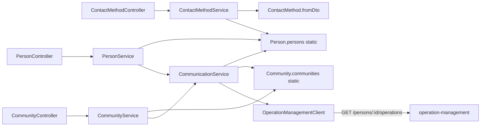

# Plan: API REST user-management

Servicio Nest ya existente en [`user-management/`](user-management/) (scaffold). Se modela **Servicio III – Personas y Comunidades** según [`user-management/src/diagramas.puml`](user-management/src/diagramas.puml), [`user-management/src/specificacions.md`](user-management/src/specificacions.md) y la consigna: comunidades ilimitadas en el sistema; **cada persona activa en como máximo 3**; para una 4.ª hay que inactivar/baja en otra, con operaciones cerradas en operation-management.

Tipado alineado al PUML (inglés): `Person`, `Community`, `ContactMethod`; campos `dni`, `fdn`, `contactPerson`, `contactMethods`, `tipe`, `favourite`. `ContactMethod` en código va en PascalCase; el PUML usa `contactMethod`.

RENAPER queda **fuera de este corte** (está en la consigna, no en la especificación del servicio).

## Arquitectura de `src/`

```
src/
  app.module.ts
  main.ts
  person/
    person.ts              # clase + static items[] + fromDto
    dto/
    person.controller.ts
    person.service.ts      # orquesta; NO guarda arrays
  community/
  contact-method/
  communication/           # $Communication (alta/activa/inactiva)
  infrastructure/
    operation-management.client.ts
```

- **Controllers** HTTP REST; reciben/devuelven DTO.
- **Services** solo reglas de orquestación (menor/mayor, tope 3, llamadas a Communication). **No** tienen `private persons = []` ni stores.
- **Modelos (mismo patrón que copy-management)**: cada entidad tiene el array estático y factories estáticas desde DTO. No hay `memory.store.ts` ni clases Repository.
- **`CommunicationService`**: sincroniza `Person.communities[]` y `Community.persons[]` y el flag `active` usando los static de las clases.
- **`OperationManagementClient`**: `GET` HTTP al otro servicio (URL por env, p. ej. `OPERATION_MANAGEMENT_URL`). No está en local; si no responde o hay operaciones abiertas, se rechaza la baja/inactivación.

Validación con `ValidationPipe` global. Dependencias a agregar: `@nestjs/axios`, `axios`, `class-validator`, `class-transformer`.

## Persistencia en memoria: static + DTO (copy-management)

No persistir colecciones en los services. Cada clase de dominio es el repositorio:

```ts
export class Person {
  static persons: Person[] = [];

  static fromDto(dto: CreatePersonDto): Person {
    const person = new Person();
    // mapear campos del dto
    Person.persons.push(person);
    return person;
  }

  static updateFromDto(id: string, dto: UpdatePersonDto): Person { /* ... */ }

  static findAll(): Person[] { return Person.persons; }
  static findById(id: string): Person | undefined { /* ... */ }
  static deleteById(id: string): void { /* ... */ }
}
```

Igual para `Community` (`Community.communities`, `fromDto(CreateCommunityDto)`) y `ContactMethod` (`fromDto` anclado a una `Person` existente).

El service queda delgado:

```ts
create(dto: CreatePersonDto) {
  return Person.fromDto(dto);
}
```

`fromDto` / `updateFromDto` son el único mapeo DTO → modelo. Los DTO viven junto al recurso (`create-person.dto.ts`, `update-person.dto.ts`, etc.) con `class-validator`.

## Modelo

Campos del PUML más lo mínimo que exige el dominio:

- **Person**: `id`, `name`, `surname`, `dni`, `contactPerson` (id o `null`), `fdn`, `communities: { communityId, active }[]`, `contactMethods[]`.
- **Community**: `id`, `name`, `persons: { personId, active }[]`.
- **ContactMethod**: `id` (necesario para PATCH/DELETE; no está en el PUML), `tipe` (`email` | `phone` | `address`), `value`, `favourite`.

`active` no está en el diagrama; es la membresía que pide la consigna y `$Communication`. Mayoría: edad >= 18 según `fdn`.



Contrato propuesto con operation-management (el otro repo aún es scaffold): `GET {base}/persons/:personId/operations` y se considera “todo cerrado” si la lista está vacía o todos los ítems tienen estado cerrado (`closed` / `returned` / equivalente). Cliente tipado y fácil de ajustar cuando exista el endpoint real.

## `$Communication`

`CommunicationService` (no es un recurso REST aparte):

- **Alta / activar** persona en comunidad: comunidad existe; persona no duplicada en esa comunidad (o se reactiva si ya estaba inactiva); **activos actuales < 3**. Si ya hay 3 activos, **409**: hay que inactivar otra primero.
- **Inactivar / baja** de una comunidad: `GET` a operation-management; si hay operaciones abiertas → **409**. Luego `active: false` o se quita el vínculo, y se sincronizan ambos arrays.
- Toda alta de persona a comunidad (POST/PATCH de Person) pasa por este método. Community **no agrega** personas nuevas.

## Endpoints

### Person — `/persons`

| Método | Comportamiento |
|---|---|
| `GET /persons` | Lista personas |
| `GET /persons/:id` | Una persona |
| `POST /persons` | Crea: `id` y `dni` únicos. Mayor: `contactPerson` opcional. Menor: `contactPerson` obligatorio, persona **ya existente y mayor**. Puede incluir comunidad(es) y medios de contacto; el alta a comunidad va por Communication (tope 3 activos). No se crea la persona de contacto en el mismo POST. |
| `PATCH /persons/:id` | Solo `contactPerson`, `communities`, `contactMethods`. No se tocan `id`, `dni`, `name`, `surname` (ni `fdn`). Comunidades: alta/activa/inactiva vía Communication. |
| `DELETE /persons/:id` | Elimina persona; se la saca de `Community.persons`. Si tiene operaciones abiertas, se rechaza (misma regla de baja). |

### Community — `/communities`

| Método | Comportamiento |
|---|---|
| `GET /communities` | Lista con `persons[]` |
| `POST /communities` | Solo `id` + `name` únicos. **Sin** personas. |
| `PATCH /communities/:id` | `name` y/o array de integrantes **ya existentes** (inactivar/quitar/actualizar `active`). **No** IDs nuevos; el alta es por Person + Communication. Quitar/inactivar exige operaciones cerradas. |
| `DELETE /communities/:id` | Borra la comunidad, no a las personas. Se resta esa comunidad en cada `Person.communities`. Si algún integrante tiene operaciones abiertas, se rechaza (es una baja de todos). |

### ContactMethod — anidado a persona

| Método | Comportamiento |
|---|---|
| `GET /persons/:id/contact-methods` | Array de la persona |
| `POST /persons/:id/contact-methods` | Persona debe existir. `tipe`, `value`, `favourite`. Si `favourite: true`, se destildan los demás. |
| `PATCH /persons/:id/contact-methods/:contactMethodId` | `tipe`, `value`, `favourite`. No se cambia de persona. |
| `DELETE /persons/:id/contact-methods/:contactMethodId` | Solo el medio. Si era `favourite`, se marca otro (si queda alguno). |

## Casos borde (errores HTTP)

- 409: DNI o `id` duplicado; 4.ª comunidad activa sin inactivar otra; operaciones abiertas al inactivar/baja/delete.
- 400: menor sin `contactPerson`; contacto que no existe o es menor; comunidad con personas en el POST; PATCH de comunidad con persona nueva; PATCH de campos inmutables de Person.
- 404: persona/comunidad/medio inexistente.
- Tope **3 activos**, no 3 membresías totales (puede haber inactivas de más).

## Archivos del scaffold

- Reemplazar el hello de [`user-management/src/app.controller.ts`](user-management/src/app.controller.ts) / [`app.service.ts`](user-management/src/app.service.ts); registrar módulos en [`app.module.ts`](user-management/src/app.module.ts).
- Puerto: `PORT` (hoy 3000); operation-management usará otro puerto para no chocar.
- Tests unitarios de Communication (tope 3, menor/mayor, sync bidireccional) y del cliente de operaciones (mock HTTP).

No se toca `operation-management` más que documentar el GET esperado.